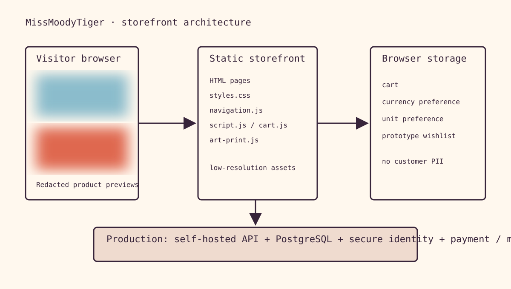
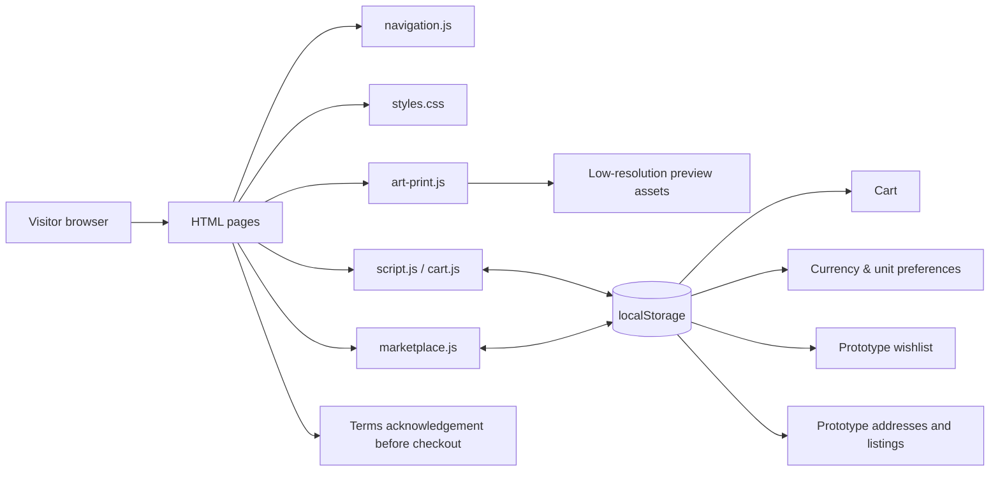

# Storefront architecture

## Current architecture

The diagram uses deliberately blurred placeholder artwork blocks. It documents the page flow without exposing clear artwork previews.

## Component responsibilities

| Component | Responsibility |
| --- | --- |
| HTML pages | Semantic structure and route-level content. |
| `navigation.js` | Shared navigation, active-tab state, currency controls, header cart count, and catalogue additions. |
| `styles.css` | Brand layout, responsive presentation, card interactions, and preview sizing. |
| `script.js` | Catalogue/home cart actions, size selection, local currency conversion, and wishlist UI. |
| `art-print.js` | Product-detail configuration, size choice, magnifier, specifications, and conditional reviews. |
| `cart.js` | Cart rows, image thumbnails, quantity controls, totals, and removal. |
| `checkout-terms.js` | Sends a customer to Terms & Conditions before checkout acknowledgement. |
| `marketplace.js` | Two-page prototype for admin-created listings, customer shop, demo email OTP login, saved addresses, and email-based order requests. |

## Production target

The static client should become a browser-only presentation layer. A self-hosted API should own product records, image uploads, accurate pricing, inventory, customer identities, email OTP generation/delivery, address storage, order state, review verification, and consent logs. Browser storage should be limited to non-sensitive presentation preferences.

Recommended open-source building blocks: PostgreSQL, an application API, an Argon2id password implementation, and Keycloak or an equivalent self-hosted identity provider. Email/SMS/WhatsApp delivery still require a provider and are not inherently free at scale.
